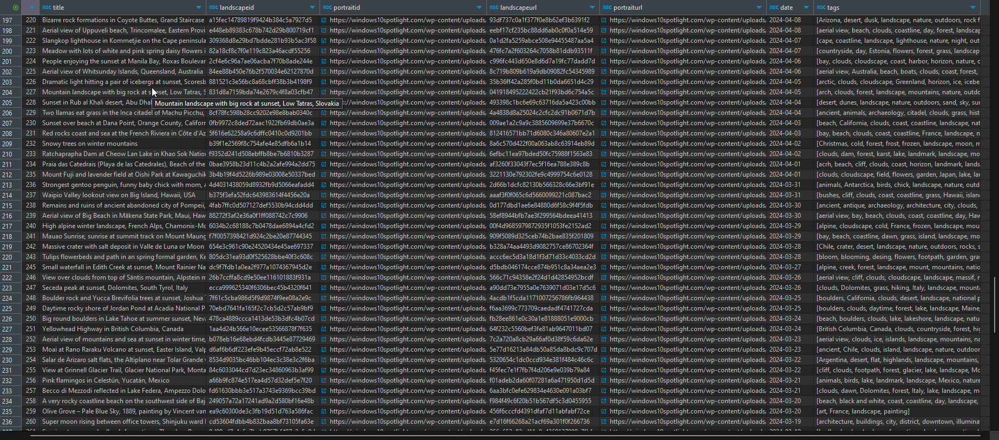
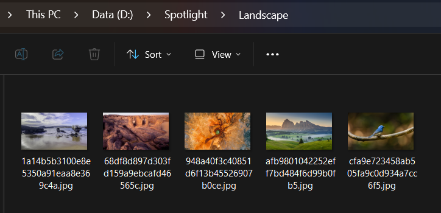

# Web Scraping 
### Windows Spotlight Images

- args1 : pagenumber (int)
- args2 : print (bool)
- args3 : download (bool)
- args4 : db (bool)
- args5 : output (str)

```cmd
java -jar spotlight.jar 1 true true true "D:\Spotlight" 
```

You can use cronjob
```sh
bash spotlight.sh 1000
```

Save to Postgresql database


Download to a folder
